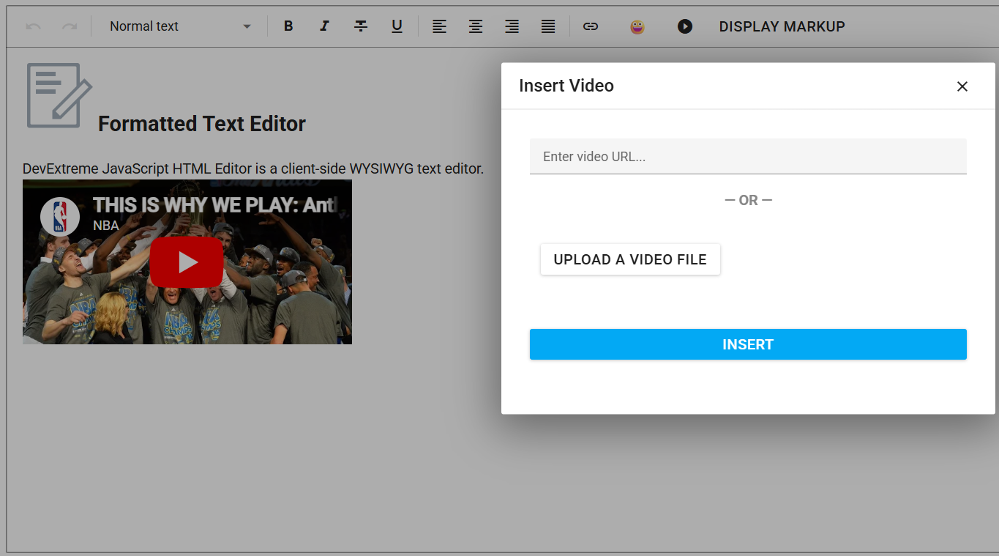

<!-- default badges list -->

[](https://docs.devexpress.com/GeneralInformation/403183)
[](#does-this-example-address-your-development-requirementsobjectives)
<!-- default badges end -->
# DevExtreme HTML Editor - Custom Toolbar Dialogs

The DevExtreme HTML Editor ships with built-in toolbar dialogs to insert links and images. This example adds new dialogs to the toolbar using custom DevExtreme Popup-based components:

- **Video dialog** — inserts a video by URL or from a local file. Supports both embedded (YouTube/Vimeo) and native `<video>` playback.
- **Link dialog** — edits the link text and URL in a custom popup with full format control.
- **Emoji popover** — inserts emoji characters from a popover.
- **Markup popup** — inspects the raw HTML markup produced by the editor.

The example also registers custom Quill blots for native `<video>` elements and wires up clipboard matchers so that pasted video links and iframes are automatically converted to the correct format.



## Implementation Details

1. Add [custom toolbar buttons](https://js.devexpress.com/Documentation/ApiReference/UI_Components/dxHtmlEditor/Configuration/toolbar/items/#widget) using the `widget: 'dxButton'` item type and handle [onClick](https://js.devexpress.com/Documentation/ApiReference/UI_Components/dxHtmlEditor/Configuration/toolbar/items/#options) to open the corresponding dialog:

```js
{ widget: 'dxButton', options: { icon: 'video',  hint: 'Insert/Edit Video',  onClick: () => openVideoDialog()  } }
{ widget: 'dxButton', options: { icon: 'link',   hint: 'Insert Custom Link', onClick: () => openLinkDialog()   } }
{ widget: 'dxButton', options: { text: '😀',     hint: 'Insert Emoji',       onClick: () => openEmojiPopover() } }
```

2. In the [onInitialized](https://js.devexpress.com/Documentation/ApiReference/UI_Components/dxHtmlEditor/Configuration/#onInitialized) event handler, obtain the editor instance, register custom Quill blots for the native video playback, and read the current selection to pre-populate each dialog:

```js
onEditorInitialized(event) {
  this.editorInstance = event.component;
  registerVideoBlots(this.editorInstance);
}
```

3. After a user confirms the operation via dialog, apply changes using the Quill APIs: 

- `insertEmbed` for video formats.
- `insertText` for link text.
- Always add a trailing newline.

```js
// video
editorInstance.insertEmbed(index, embedType, url);
editorInstance.insertText(index + 1, '\n', {});
editorInstance.setSelection(index + 2, 0);

// link
editorInstance.delete(index, length);
editorInstance.insertText(index, text, formats);
```

4. Use `customizeModules` to configure clipboard matchers that intercept pasted `<a>`, `<iframe>`, and `<video>` elements and automatically convert them to the appropriate embed format.

## Files to Review

- **Angular**
    - [app.component.html](Angular/src/app/app.component.html)
    - [app.component.ts](Angular/src/app/app.component.ts)
    - [video-dialog.component.ts](Angular/src/app/components/video-dialog/video-dialog.component.ts)
    - [link-dialog.component.ts](Angular/src/app/components/link-dialog/link-dialog.component.ts)
    - [emoji-popover.component.ts](Angular/src/app/components/emoji-popover/emoji-popover.component.ts)
    - [clipboard-matchers.ts](Angular/src/app/helpers/clipboard-matchers.ts)
    - [video-blots.ts](Angular/src/app/helpers/video-blots.ts)
- **React**
    - [App.tsx](React/src/App.tsx)
    - [VideoDialog.tsx](React/src/components/video/VideoDialog.tsx)
    - [LinkDialog.tsx](React/src/components/link/LinkDialog.tsx)
    - [EmojiPopover.tsx](React/src/components/emoji/EmojiPopover.tsx)
    - [useVideoDialog.ts](React/src/hooks/useVideoDialog.ts)
    - [useLinkDialog.ts](React/src/hooks/useLinkDialog.ts)
    - [useEmojiPopover.ts](React/src/hooks/useEmojiPopover.ts)
    - [clipboardMatchers.ts](React/src/helpers/clipboardMatchers.ts)
- **Vue**
    - [App.vue](Vue/src/App.vue)
    - [HomeContent.vue](Vue/src/components/HomeContent.vue)
    - [VideoPopup.vue](Vue/src/components/VideoPopup.vue)
    - [LinkPopup.vue](Vue/src/components/LinkPopup.vue)
    - [EmojiPopup.vue](Vue/src/components/EmojiPopup.vue)
    - [useVideoPopup.ts](Vue/src/composables/useVideoPopup.ts)
    - [useLinkPopup.ts](Vue/src/composables/useLinkPopup.ts)
    - [useEmojiPopup.ts](Vue/src/composables/useEmojiPopup.ts)
- **jQuery**
    - [index.html](jQuery/src/index.html)
    - [index.js](jQuery/src/index.js)
    - [VideoPopupHelper.js](jQuery/src/helpers/VideoPopupHelper.js)
    - [LinkPopupHelper.js](jQuery/src/helpers/LinkPopupHelper.js)
    - [EmojiPopupHelper.js](jQuery/src/helpers/EmojiPopupHelper.js)
- **ASP.NET Core**
    - [Index.cshtml](ASP.NET%20Core/Views/Home/Index.cshtml)
    - [_VideoPopup.cshtml](ASP.NET%20Core/Views/Home/_VideoPopup.cshtml)
    - [_LinkPopup.cshtml](ASP.NET%20Core/Views/Home/_LinkPopup.cshtml)
    - [_EmojiPopup.cshtml](ASP.NET%20Core/Views/Home/_EmojiPopup.cshtml)
    - [VideoPopupHelper.js](ASP.NET%20Core/wwwroot/js/helpers/VideoPopupHelper.js)
    - [LinkPopupHelper.js](ASP.NET%20Core/wwwroot/js/helpers/LinkPopupHelper.js)
    - [EmojiPopupHelper.js](ASP.NET%20Core/wwwroot/js/helpers/EmojiPopupHelper.js)

## Documentation

- [HTML Editor Overview](https://js.devexpress.com/Documentation/Guide/UI_Components/HtmlEditor/Overview/)
- [HTML Editor — Toolbar](https://js.devexpress.com/Documentation/Guide/UI_Components/HtmlEditor/Toolbar/)
- [Popup Overview](https://js.devexpress.com/Documentation/Guide/UI_Components/Popup/Overview/)
- [Angular HTML Editor Documentation](https://js.devexpress.com/Angular/Documentation/Guide/UI_Components/HtmlEditor/Getting_Started_with_HtmlEditor/)
- [React HTML Editor Documentation](https://js.devexpress.com/React/Documentation/Guide/UI_Components/HtmlEditor/Getting_Started_with_HtmlEditor/)
- [Vue HTML Editor Documentation](https://js.devexpress.com/Vue/Documentation/Guide/UI_Components/HtmlEditor/Getting_Started_with_HtmlEditor/)
- [jQuery HTML Editor Documentation](https://js.devexpress.com/jQuery/Documentation/Guide/UI_Components/HtmlEditor/Getting_Started_with_HtmlEditor/)
- [ASP.NET Core HTML Editor Documentation](https://docs.devexpress.com/AspNetCore/401367/devextreme-based-controls/controls/html-editor)
<!-- feedback -->
## Does This Example Address Your Development Requirements/Objectives?

[](https://www.devexpress.com/support/examples/survey.xml?utm_source=github&utm_campaign=devextreme-htmleditor-custom-dialog&~~~was_helpful=yes) [](https://www.devexpress.com/support/examples/survey.xml?utm_source=github&utm_campaign=devextreme-htmleditor-custom-dialog&~~~was_helpful=no)

(you will be redirected to DevExpress.com to submit your response)
<!-- feedback end -->
